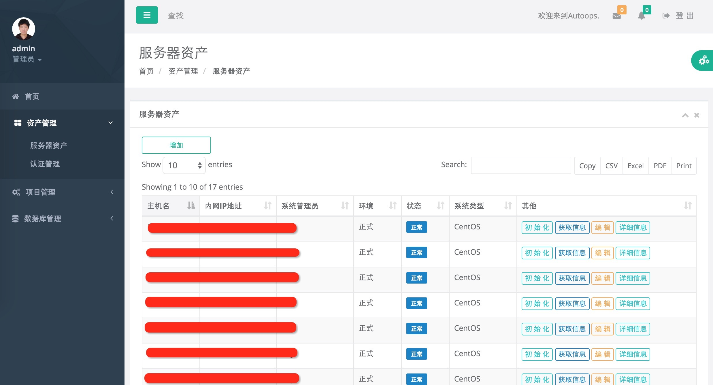

## 自动化运维平台使用说明



### 一、用户
只有超级管理员可以对用户和用户组进行管理，在左上角个人头像下面点击，会有用户管理和用户组管理。
在用户中可以添加用户，修改用户信息、权限以及所在组，在用户组中可以添加用户组，修改用户组权限。

### 二、资产
资产分为两个：
  * 服务器资产
  * 登陆认证资产
服务器资产是作为项目管理以及其他管理的基础，登陆认证资产包括服务器登陆，代码仓库登陆等认证。

所以在录入操作中，请先录入相关登陆认证信息。

### 三、项目
项目流程从测试开始，测试没问题的代码转移到运维的svn仓库存档，以便发布到预发布环境和正式环境。
项目信息的录入流程为：项目录入->测试录入
  * 项目录入包括：预发布和正式服务器及路径，运维svn仓库认证配置（在项目信息中）

  * 测试录入包括：测试服务器及路径，开发仓库认证配置（在xx测试发布中）

发布流程为：测试->存档到svn->预发布环境发布->正式环境发布

  * 测试 在xx测试发布中，将开发仓库代码发布到测试环境中

  * 存档svn 在xx测试发布中，将测试通过的代码存档到运维svn仓库

  * 预发布环境发布 在运维版本发布中，选择svn仓库中项目对应的版本号发布

  * 正式环境发布 在运维版本发布中，选择svn仓库中项目对应的版本号发布
预发布环境和正式环境的发布日志可以在发布记录中查看

### 四、其他功能
用户个人信息，密码更改，密码找回，系统消息，邮件发送。

### 五、安装说明

``` bash
# pip freeze
amqp==1.4.9
anyjson==0.3.3
backports-abc==0.4
backports.ssl-match-hostname==3.5.0.1
billiard==3.3.0.22
celery==3.1.20
certifi==2015.11.20.1
decorator==4.0.6
Django==1.8
django-bootstrap-form==3.2
django-global-permissions==0.2.2
django-guardian==1.4.1
dulwich==0.9.1
funky==0.0.2
futures==3.0.4
gitdb==0.6.4
gittle==0.5.0
ipython==4.0.3
ipython-genutils==0.1.0
Jinja2==2.8
kombu==3.0.33
MarkupSafe==0.23
meld3==1.0.2
msgpack-python==0.4.6
MySQL-python==1.2.5
paramiko==1.10.0
path.py==8.1.2
pexpect==4.0.1
pickleshare==0.6
ptyprocess==0.5
pycrypto==2.6
python-dateutil==2.2
pytz==2015.7
PyYAML==3.11
pyzmq==15.2.0
redis==2.10.5
requests==2.9.1
salt==2015.8.3
salt-api==0.8.4.1
simplegeneric==0.8.1
singledispatch==3.4.0.3
six==1.7.2
smmap==0.9.0
supervisor==3.2.1
svn==0.3.36
tornado==4.3
traitlets==4.1.0
uWSGI==2.0.12
```

其次还需要安装redis，MySQL，saltstack，salt-api。